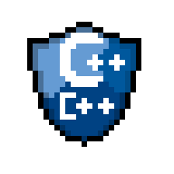

#  :ocean::boat: Gabriel's GitHub :rowboat::man:‍:computer: 

<h3> Whoami ()  { </h3>

> :mortar_board::computer: I'm a Computer Science student at Universidade Estadual do Ceará (UECE) and I intend to do a master's degree in Computer Networking;
>
> :wrench::microscope: Working at [ETICE](https://www.etice.ce.gov.br/) as a Full Stack developer (Web development). Also working at Laboratório de Matemática Computacional (LaMaC) with research in Digital Image Processing applied to medical images and Artificial Intelligence;
>
> :hammer::scroll: My main programming languages are <i>Python</i> and <i>JavaScript</i> (and <i>C++</i> for hobby), but I am currently working with PHP;
>
> :books::video_game: My hobbies are studying Computer Networking, Game Development and Electronics;

<h3> } </h3>

##

<h3> WorkTools ()  { </h3>

>      
>      
>      
>     
>      
>     
>    
>     
>     
>     
>    

<h3> } </h3>

##

<h3> Statistics ()  { </h3>

>  
> <a href="https://github.com/GabrielLins64/">
 > 
 > 
</a>

<h3> } </h3>

##

<h3> Contact ()  { </h3>

> 

<h3> } </h3>
