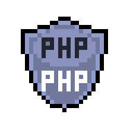

<h1 align="center">
  
  Gabriel's GitHub
  
</h1>

```python
def about_me():
```

> 🧑‍💻 Tech Lead (Web Full Stack Developer and IT Manager) at <a href="https://www.etice.ce.gov.br/">ETICE</a>

> 🎓 B.Sc. in Computer Science from <a href="http://www.uece.br/">Ceará State University (UECE)</a>

> 🧪 In progress MS. in Algorithms, Optimization and Artificial Intelligence at <a href="http://www.uece.br/">Ceará State University (UECE)</a>

> 🧑‍🔬 Internship at [Computational Mathematics Laboratory (LaMaC)](https://github.com/LAMAC-UECE). Worked with Digital Image Processing applied to medical images and Artificial Neural Networks for data classification and recognition (mainly images and NLP).

> 📚 Studying Math, Physics, Electronics and Data Science by hobby

> 🛠️ Current main development stack:
> - 🐍 Python (Django and Flask);
> - ⚛️ React;
> - 🐘 PHP;

<br>

```python
def programming_languages():
"""Programming languages in which I have experience."""
```

<div align="center">

  
  <br>

  
  <br>

  
  
  <br>


</div><br>


```python
def technologies():
"""Libraries, Frameworks, DBMS, Operating Systems,
   Infra and other tools I have experience with."""
```

<div align="center">
  <details>
  <summary> Click here to toggle... </summary><br>

  <table>
  <tr align="center">
    <td width="400" valign="top">
      <h2>Back-end</h2>
      
      <br>
      
      
      <br>
      
      <br>
    </td>
    <td width="400" valign="top">
      <h2>Front-end</h2>
      
      <br>
      
      <br>
      
      <br>
    </td>
  </tr>
  <tr align="center">
    <td valign="top">
      <h2>DBMS / DB libs</h2>
      
      <br>
      
      <br>
      
      
      <br>
    </td>
    <td valign="top">
      <h2>Deploy and Cloud</h2>
      
      
      <br>
      
      
    </td>
  </tr>
  <tr align="center">
    <td valign="top">
      <h2>Operating Systems / Kernel</h2>
      
      <br>
      
      <br>
      
    </td>
    <td valign="top">
      <h2>Scientific</h2>
      
      <br>
      
       <br>
    </td>
  </tr>
  <tr align="center">
    <td valign="top">
      <h2>Testing</h2>
      
    </td>
  </tr>
  </table>
  </details>
</div><br>

```python
def statistics():
"""My GitHub statistics."""
```

<div align="center">
  <details>
  <summary> Click here to toggle... </summary><br>

  <br><br>

  <br><br>

  <br><br>

  

  </details>
</div><br>


```python
def more_info():
"""About me in external sources."""
```

<div align="center">
  <a href="https://www.linkedin.com/in/gabrielfurtadolinsmelo/)">
    
  </a>

  <a href="https://buscatextual.cnpq.br/buscatextual/visualizacv.do?id=K8029036T9&tokenCaptchar=03AFY_a8WeBa7E6t-KTQvsOLFeVk3RVJ71r9wCBAykgFsCv37kJkcbq0TqrZsEDI43_i5efpDOiz9HKnR2HtsY8JBdkyGIgscghZ_HuHX667xsbCJo7ROSx-KbqmOqjm-RpbdoBKe3LI34pGLvre-3nXnugmNmn_uC4F0JQXrF4zv3hFyxpp25pfm1mjKrFWVd91c7M1Tf1ywwp1-gXEPt8WYR7aQJ0Bk9-3zPb1g3Nldxh-tDJ8HFtbQcVBtSOdEp1f5hE6BujBGu81XsoFyh26c9oMnXEiO5vg03ZXFsWpCeMXcCndT0cwnA8lJ_FiSpsEK4xgoibakI-oc4tOAq28KYyseXxDSMPO0BIjR4Pcyj-pGk4pzxGLuK_phvIM9LpBF_fqLUY0SOWfvF8O4AYrE59GNqgtmbYoW0PeygHKpfpcwMlkHk42yXxsLlmDG7JVK-JXkUCkWjVz1YP3GT6tVtZhdZclyDeBgwTnC2ekeAG0w4wB_Qr-VwUCk9guG42or0GH7ZA8mf2WSjNQpJvhH3AOYzy4QI3uluDQYYrUCoLAbR78_F2TP6hszP0HDMUhsWKC_wKxjUwj-RW3FiNZq-zeayIUJdIA">
    
  </a>
</div><br>

```python
def contact_me():
"""Talk to me on social media."""
```

<div align="center">
  <a href="mailto:gabrielinsmelo@gmail.com">
    
  </a>

  <a href="https://www.instagram.com/gabrielins.py/">
    
  </a>

  <a href="https://discordapp.com/users/533823605830713354/">
    
  </a>
</div><br>
